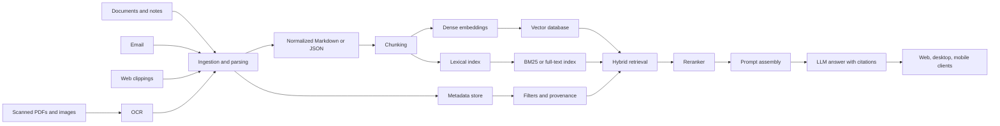
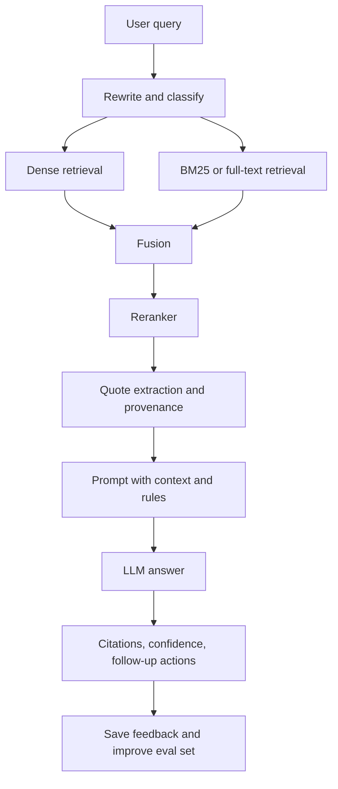

# Building a Second Brain You Can Access Anywhere

## Executive summary

The best overall design for your use case is **a hybrid, local-first knowledge system**: keep your canonical files, normalized text, metadata, and primary search index under your control; expose them through a **browser-first app/PWA** that works on desktop and mobile; and use a **strong cloud model only as a reasoning fallback** when local models are not good enough. This is the best balance of privacy, accuracy, cost, and “access from anywhere.” A fully local system minimizes privacy risk and recurring cost, but it is harder to make feel great across mobile/web and will usually underperform on long-document reasoning and messy multimodal sources. A cloud-first system is easiest to access anywhere and strongest on answer quality, but it gives up the most privacy and creates ongoing platform cost and vendor dependence. citeturn37search0turn37search1turn37search2turn37search11turn19search2turn19search8

For a second brain, **retrieval quality matters more than fine-tuning** in the early stages. The strongest initial stack is: structured ingestion with layout-aware parsing and OCR, a canonical normalized store, hybrid retrieval combining **lexical/BM25 and dense vectors**, reranking, grounded answer generation with citations, and a lightweight evaluation set of your own real questions. That architecture is directly aligned with the RAG literature and with current search platforms that emphasize hybrid search and reciprocal-rank fusion. citeturn0search0turn18search1turn18search4turn18search8turn5search1turn35search9

The Karpathy material points in the same direction. His site explicitly separates a **fundamentals track** on how LLMs work from a **practical guide** on how he uses them, and his later YC talk frames the current moment as **“Software 3.0,”** where natural language becomes a programming interface. The right takeaway for a second brain is that **chat is the interface, not the database**: your real system still needs deterministic substrates below the chat layer—files, metadata, indexing, retrieval, backups, and evaluation—because the model alone is probabilistic and opaque. His earlier “Software 2.0” essay makes the same deeper point: learned weights are powerful, but they are not a substitute for disciplined system design. citeturn25search1turn25search0turn26search0

My recommended build therefore is: **Qdrant or LanceDB/Qdrant for retrieval, SQLite for metadata and full-text fallback, Docling/Unstructured/Tika plus OCRmyPDF for ingestion, a React/Next.js PWA for universal access, Tauri for desktop-native filesystem integration on your main machine, and either a local model runtime such as Ollama/llama.cpp or a cloud reasoning model such as Claude Sonnet or OpenAI GPT-4.1-class APIs for difficult queries.** If you want one decision in one sentence: **build a local-first, browser-accessible hybrid system with secured remote access and cloud fallback.** citeturn34search3turn35search0turn27search0turn11search0turn11search1turn11search3turn11search10turn36search1turn36search6turn7search17turn40search9turn16search0turn16search5turn19search2turn19search8

## Assumptions and design goals

I am assuming your **primary ownership model is still local-first**, but your latest requirement adds an equally important constraint: **you want access from desktop, web, and mobile, from anywhere**. That changes the architecture. A pure desktop-only private vault is not enough; you need either a centrally reachable service or synchronized replicas. In practice, a “second brain” that feels seamless across devices usually converges on one of two patterns: a **central search and answer service reachable over a private network**, or a **replicated vault with sync plus a shared or recomputed index**. The central-service pattern is simpler to keep consistent. citeturn13search5turn13search9turn13search12turn36search6

Some key details are unspecified, and they materially affect recommendations: your operating system, corpus size, document mix, budget, whether work/non-work data are mixed, whether you want offline mobile access, and whether you accept any cloud processing for reasoning. If your corpus is small to medium and mostly text/PDF/notes, an embedded or single-node design is enough. If it grows into hundreds of thousands of documents, archives of email, image-heavy PDFs, or multimodal media, you should prefer a proper server-mode vector/search service and a more aggressive parsing pipeline. citeturn11search0turn11search6turn34search3turn35search0

One limitation: you previously mentioned **two YouTube links**, one being the Andrej Karpathy channel and one being a specific video, but the specific non-Karpathy link was not visible in the conversation context available to me here. I therefore incorporated Karpathy’s published channel-level themes and talks, but I am not attributing any claims to the unavailable second video. The Karpathy material I used is his official site, his YouTube channel/video pages, and his YC talk summary. citeturn25search1turn21search0turn21search1turn23search20turn25search0

The design goals I would optimize for are straightforward: **privacy by default, deterministic storage, searchable provenance, graceful OCR/document handling, hybrid retrieval, clear citations, low operational load, and universal access through a web-first interface.** That mix makes the system useful for both “remember what I saved” and “help me think across everything I know.” citeturn11search1turn11search3turn18search1turn18search4turn37search17

## Architecture and pipeline choices

A robust second brain should have a layered architecture: **sources → ingestion → normalization → canonical storage → indexing → retrieval/reranking → answer generation → clients**. The critical insight is that each layer should be replaceable. You do not want your notes trapped inside a single app or your search quality tied to one model API. Karpathy’s “Software 3.0” framing supports the natural-language interface, but the system underneath should remain boring, versionable, and inspectable. citeturn25search0turn26search0turn0search0



### Ingestion pipelines

For input coverage, the strongest ingestion baseline is: **Tika or Unstructured for broad file extraction, Docling or Unstructured for structure-aware parsing of complex documents, OCRmyPDF for scanned PDFs, native email APIs for Gmail/Microsoft 365, and a small browser extension for web clipping**. Tika can detect and extract metadata/text from a very wide range of file types; Unstructured supports common office, email, image, HTML, Markdown, and PDF formats; Docling is specifically designed around rich document structure with text, tables, pictures, hierarchy, and layout provenance; OCRmyPDF adds a searchable text layer to scanned PDFs. citeturn11search0turn11search6turn11search3turn11search7turn11search1turn11search5

For email, use the **Gmail API** if your mail lives in Google Workspace/Gmail and **Microsoft Graph** if it lives in Microsoft 365/Outlook. Both expose message listing and retrieval, which is much more reliable than scraping local mail clients. For web clippings, a small **Manifest V3** browser extension is now the correct path in Chromium-based browsers, and Chrome’s storage APIs plus your own backend are enough to capture URL, page title, timestamp, selected text, and cleaned article content. citeturn12search6turn12search0turn12search9turn12search13turn12search10turn12search2turn12search14turn12search5turn12search20

Your normalization format should not be raw chunks only. Store a **canonical normalized object** for each source document: original file path or blob ID, extracted text, document title, author/sender, timestamps, section outline, page/paragraph anchors, tags, and parsing confidence. Docling’s structured document representation is especially useful here because it preserves section hierarchy and layout facts that later improve chunking and citations. citeturn11search7turn11search3turn11search10

### Storage and indexing

For storage, separate the problem into three parts: **canonical file storage**, **metadata/full-text**, and **vector search**. Canonical files can stay in your filesystem or object storage; metadata and filters fit naturally in SQLite; vectors belong in a vector/search engine. SQLite’s FTS5 gives you a dependable embedded lexical index, and DuckDB also offers a full-text-search extension if your workflows are analytics-heavy. citeturn27search0turn27search1turn27search2

For vector storage and retrieval, the main practical options are these:

| Option | Best fit | Main strengths | Main weaknesses |
| --- | --- | --- | --- |
| **Qdrant** | Best default for self-hosted second brain | Proper server architecture, local quickstart, hybrid retrieval with dense+sparse fusion, metadata filtering, real-time indexing. citeturn34search3turn34search0turn34search7turn5search1 | More operational overhead than pure embedded libraries. |
| **Chroma** | Fastest path to a local prototype | Very easy local start, persistent client or client-server mode, built for retrieval workflows. citeturn5search2turn34search5turn34search9 | Less opinionated for production-hardening than Qdrant. |
| **FAISS** | Embedded dense retrieval inside your own app | Very fast similarity search with CPU/GPU support and broad algorithm choices. citeturn5search0turn34search10turn34search13 | Dense vectors only; you must add metadata, persistence rules, and lexical/hybrid logic yourself. |
| **LanceDB** | Embedded, file-native local-first builds | Local/embedded feel, one system for vectors plus full-text and hybrid search, good fit for AI-native local apps. citeturn35search0turn35search9turn35search12 | Less “classic server” operational model than Qdrant. |

If your priority is **one-node local-first with graceful future expansion**, Qdrant is the safest default. If your priority is **minimal friction for a desktop prototype**, Chroma or LanceDB is attractive. If you are comfortable writing more of the search stack yourself, FAISS is still excellent. citeturn34search3turn35search0turn5search0

### Embeddings and chunking

Use **page/section-aware chunking**, not fixed windows over raw text. The best practical rule is to chunk semantically by heading, paragraph, list, code block, table, email thread, or note section, then apply size limits afterward. OpenAI’s file-search defaults—**800-token chunks with 400-token overlap**—are a good baseline for generic document retrieval, but richer source-aware chunking often works better for a personal knowledge system. OpenAI’s PDF/RAG guidance also recommends adding summaries and headers during preprocessing so retrieval sees better-formed units. citeturn6search7turn6search3turn11search10turn11search7

For embeddings, the right split is usually: **cheap local embeddings by default**, **stronger hosted embeddings when multilingual depth or recall really matters**. OpenAI’s `text-embedding-3-small` is explicitly positioned as the low-cost embedding option at **$0.02 per 1M tokens**, while `text-embedding-3-large` is the more capable but costlier choice at **$0.13 per 1M tokens**. Open models such as `nomic-embed-text`, BGE-M3, and Jina embedding families are credible local alternatives; BGE-M3 is designed for multi-function, multilingual, and multi-granularity retrieval, and Jina’s newer families target complex document retrieval. citeturn42view0turn42view1turn17search1turn17search0turn17search2

### Retrieval and answer generation

For retrieval, the default answer is **hybrid search**: lexical/BM25 and vector search in parallel, merged with fusion or reranking. That is now the clearest production pattern across Azure AI Search, Elastic, Qdrant, and LanceDB. Semantic search alone misses exact terms, names, and snippets; lexical search alone misses conceptual similarity. Hybrid search gives you both. citeturn18search1turn18search4turn18search0turn5search1turn35search9

Your answer layer should follow a strict sequence: **query normalization → hybrid retrieval → reranking → prompt assembly with document quotes → generated answer with citations and abstention rules**. Anthropic’s own hallucination-reduction guidance recommends explicitly allowing the model to say “I don’t know” and, for long-document work, grounding on direct quotes before synthesis. That is exactly the right behavior for a second brain. citeturn37search17turn0search0



### User interface and access model

Because you want access from **desktop, web, and mobile**, the most scalable UI strategy is **browser-first**. React remains the standard component model, Next.js gives you a mature full-stack React framework with the App Router, and a PWA gives you installability and broad device reach from one codebase. This is a better default than starting with a desktop-native application and trying to retrofit mobile/web later. citeturn36search0turn36search1turn36search6turn36search14

Use **Tauri** when your desktop app needs real filesystem integration, background watchers, or local model control on your primary machine. Tauri supports any frontend framework, targets desktop and mobile, and provides a capability-based permission system that is more security-oriented by default. Use **Electron** only if you need its larger ecosystem or existing Node-focused tooling; Electron is perfectly viable, but its own docs still emphasize a long security checklist around secure content, context isolation, sandboxing, and CSP. citeturn7search17turn40search9turn40search3turn40search13turn8search0turn40search0

For orchestration, **LlamaIndex** is especially strong when the app is mostly about your own data, connectors, indexing, and retrieval. **LangChain/LangGraph** is stronger when you need custom workflow orchestration, durable state, and more explicit agent control. **AutoGen** only becomes worth it when you truly want multi-agent collaboration patterns. For a second brain, avoid “agent inflation” at the start; build retrieval and answers first, then add workflows such as “summarize this project,” “find related notes,” or “draft from my stored context.” citeturn10search0turn10search2turn7search2turn7search14turn7search4

### Security, backups, and sync

For privacy and resilience, combine **full-disk encryption**, **private network access**, **versioned backups**, and **encrypted offsite copies**. For remote access, Tailscale’s tailnet model is a clean way to expose your private service without placing it directly on the public internet. For sync of trusted devices, Syncthing is a strong local-first choice and also supports encrypted sharing to untrusted devices. For backups, Restic provides encrypted, deduplicated backups across local and cloud backends; if you want an extra encrypted layer over commodity cloud storage, rclone’s `crypt` backend is a practical addition. citeturn13search5turn13search9turn13search13turn13search12turn13search8turn14search5turn14search0turn14search9turn15search1

Cloud privacy differs materially by vendor. OpenAI states that API data is **not used to train models unless you opt in**. Anthropic documents standard retention arrangements and offers **zero-data-retention** options. Google Cloud states that customer data used in Agent Search is **not used to train foundation models**. Azure OpenAI states that customer data is **not used to retrain models**. These facts matter when deciding how much of your second brain you will allow into cloud reasoning. citeturn37search0turn37search1turn37search2turn37search11

## Models and adaptation choices

### Open models for local use

The open models you named are all usable, but in 2026 they should be treated mostly as **legacy or baseline families**, not first-choice “best available” models for a fresh second-brain system. Among them, **Mistral 7B** is the best old-generation fit for local deployment because it has an Apache 2.0 license, 32k context, and Mistral’s own card estimates roughly **20 GB at bf16 and 5 GB at fp4** for weights. But Mistral’s documentation also marks that card as retired and points to newer replacements, which is a signal that you should only start there if you specifically want a small, older, stable baseline. citeturn41view0

**Llama 2** remains important historically and still has broad tooling, with model sizes from **7B to 70B** and a default context of **4096** in common distributions. But it is clearly older than current open-model families. **Vicuna** is chat-tuned and was fine-tuned from Llama/Llama 2 on ShareGPT conversations, which made it a strong chat benchmark in its era, but it inherits the age and licensing profile of its base family. **Falcon 7B-Instruct** is Apache 2.0 and still attractive if license simplicity matters, but it is also an older quality frontier. citeturn28search2turn28search3turn29search1turn29search0turn29search3

In plain English: **if you force yourself to choose only from Llama 2, Mistral 7B, Vicuna, and Falcon, pick Mistral 7B first, Llama 2 second, Vicuna third, Falcon fourth.** If you are not constrained to those families, I would not start a new second-brain project with them unless you already know why. citeturn41view0turn28search2turn29search1turn29search3

### Cloud models and platforms

On the paid side, the strongest current pattern is not “one best model,” but **one best platform policy**: use a high-quality general model for synthesis, and keep your retrieval and storage architecture portable. Anthropic’s current model overview shows **Claude Sonnet 4.6** at **1M context**, positioned as fast with strong search/analysis capability and priced at **$3 per million input tokens and $15 per million output tokens**. That is excellent for long-document reasoning over retrieved context. Anthropic also explicitly notes that public API fine-tuning is not currently offered. citeturn19search2turn19search14turn38search1

OpenAI’s current docs show that **GPT-4** is now an **older** model with **8,192 context** and relatively high pricing, while **GPT-4.1** is a stronger current “GPT-4 class” option with **1M context** and pricing of **$2 per 1M input tokens and $8 per 1M output tokens**. The OpenAI embeddings stack is cheap enough to be attractive for cloud-first retrieval as well: `text-embedding-3-small` is **$0.02 per 1M tokens**, and OpenAI’s hosted vector-store/file-search pricing is **free up to 1 GB**, then **$0.10/GB/day** beyond that. citeturn19search4turn19search8turn42view0turn6search4

Azure is best understood less as a distinct model family and more as an **enterprise deployment and governance plane**. Azure AI Search supports hybrid search in one request and uses **RRF** for merged ranking; Azure OpenAI “On Your Data” is the corresponding grounding layer. Azure also documents LoRA-based fine-tuning support in Foundry. If you care about enterprise identity, networking, compliance, and Microsoft ecosystem fit, Azure is a compelling hosting choice even when the underlying model is an OpenAI family model. citeturn18search1turn18search8turn37search3turn38search3turn37search7

Google’s old **PaLM** path should now be considered **legacy/deprecated** for new work. For a new system you should use **Gemini API** or **Gemini Enterprise Agent Platform** instead. Google’s current docs show Gemini models and a broader managed agent/search platform; supervised and preference tuning are available in Vertex/Gemini Enterprise tooling. citeturn4search0turn4search2turn20search8turn20search11turn38search18turn38search10

### Quantization, memory, and fine-tuning

The practical rule for local inference is simple: **quantization buys you feasibility, but costs you some quality headroom**. Bitsandbytes and PEFT document the standard 8-bit and 4-bit workflows, and QLoRA showed that 4-bit quantization can still support effective fine-tuning. A raw heuristic is: weight memory is roughly **parameter count × precision**, so 4-bit variants are about half the footprint of 8-bit variants; real runtime memory is higher because you still need KV cache and framework overhead. Mistral’s own 7B card—about **20 GB bf16 vs 5 GB fp4**—matches this order of magnitude. citeturn30search3turn30search11turn0search2turn41view0

For local user hardware, that means a **7B model in 4-bit** is realistic on consumer hardware; **13B in 4-bit** is possible but tighter; **70B in 4-bit** is generally not a pleasant default for a desktop second brain unless you have very high-end GPU or server-class memory. Ollama’s docs also make the operational constraint explicit: concurrent models must fit in **VRAM** for GPU inference, and model files themselves can occupy **tens to hundreds of gigabytes** on disk. citeturn39search2turn39search0turn39search1

Do **not** fine-tune your model just to “store your knowledge.” That is the wrong abstraction. RAG is for **fresh, inspectable, updateable facts**; fine-tuning is for **behavioral adaptation** such as tone, structure, classification style, output schema, domain-specific formats, or improved tool use. LoRA and QLoRA are appropriate when you need a model to consistently behave a certain way, not when you need it to remember your latest files. This is exactly why RAG became the standard architecture for knowledge-intensive tasks. citeturn0search0turn0search1turn0search2turn30search6turn38search8turn38search7

Instruction tuning remains useful in a second-brain context when you want better **query rewriting, citation style, answer format, task decomposition, or note synthesis style**. The InstructGPT and FLAN lines remain the core references here: instruction tuning and feedback-aligned fine-tuning improve task following and can beat much larger untuned models in practice. But again, that should come **after** retrieval quality is good. citeturn30search0turn30search5turn30search20

## Implementation blueprints

### Fully local free-LLM build

This option is for maximum privacy and near-zero recurring cost. Canonical files live on your machine or your own synced storage. Parsing uses **Tika + Docling/Unstructured + OCRmyPDF**. Metadata and full text live in **SQLite FTS5**. Vectors live in **Qdrant** or **LanceDB**. Local generation and embeddings run through **Ollama** or **llama.cpp**, exposed behind a simple local API. The frontend is a **React app**, optionally wrapped with **Tauri** on desktop. Access from anywhere is achieved with **Tailscale** rather than a public endpoint. citeturn11search0turn11search3turn11search6turn11search1turn27search0turn34search3turn35search0turn16search0turn16search5turn36search0turn7search17turn13search5

A high-level build looks like this:

```bash
# local model runtime
ollama serve
ollama pull mistral
ollama pull nomic-embed-text

# vector db
docker run -p 6333:6333 -v qdrant_storage:/qdrant/storage qdrant/qdrant

# frontend
npm create vite@latest second-brain -- --template react-ts
npm create tauri-app@latest
```

Use hybrid retrieval even locally: store the same chunk in SQLite FTS5 and the vector index, retrieve from both, fuse, rerank, then answer with the local model. For remote access, do not expose Qdrant or your local LLM directly to the Internet; expose only your app service over Tailscale. Back up the canonical vault and indexes using Restic, and optionally sync raw files to your other trusted devices with Syncthing. citeturn18search1turn18search8turn13search9turn14search5turn13search12

**Hardware.** A modern CPU-only machine can work for small local models, but a comfortable experience starts when you have GPU/accelerator memory for a 7B-class quantized model. Ollama supports current NVIDIA GPUs broadly, and Mistral’s own card suggests the 7B class is feasible in fp4 around the 5 GB weight range. In practical terms, a **consumer GPU with 12–16 GB VRAM** is the sweet spot for a pleasant all-local setup; CPU-only is viable but slower. citeturn39search1turn41view0turn39search2

**Estimated cost.** Software cost is effectively **$0 recurring**. Hardware cost depends on what you already own; if you need to buy a GPU, the current consumer 16 GB market snapshot is roughly **mid-hundreds of USD for entry 16 GB cards** and substantially more for high-end cards, while compact Apple Silicon desktops offer a clean CPU/GPU-integrated alternative at a higher upfront price. Those market ranges fluctuate, so treat them as broad planning bands, not fixed quotes. citeturn32view1turn31search3

**Expected performance.** Privacy is excellent; recurring cost is excellent; answer quality is acceptable to good for note lookup and short synthesis, but weaker on complex long-document reasoning and mixed-modality knowledge unless you invest heavily in retrieval quality and careful parsing. This option is best when privacy is non-negotiable and you are willing to accept lower ceiling performance. citeturn0search0turn11search3turn37search17

### Hybrid local-first with paid-model fallback

This is the best **general recommendation**. Keep ingestion, canonical storage, metadata, and retrieval **under your control**, but route difficult synthesis to a paid API. Retrieval remains local/self-hosted, so the cloud model only sees the **top retrieved snippets**, not your full vault. That materially reduces privacy exposure while giving you much better answer quality than a purely local 7B-class model. citeturn37search0turn37search1turn37search11turn18search1

A strong stack is: **Docling/Unstructured/OCRmyPDF → Qdrant + SQLite FTS5 → reranker → LLM router**. Use local embeddings first, then route generation to **Claude Sonnet 4.6** for hard queries, large syntheses, and “think across many notes” tasks. If you prefer OpenAI, use a **current GPT-4.1-class endpoint** rather than legacy GPT-4. The UI should be **Next.js + PWA**, with Tauri only on the main desktop if you want drag-drop ingest and background watchers. Access from anywhere can be done through a private reverse path like Tailscale or a properly authenticated web deployment. citeturn11search3turn11search6turn11search1turn34search3turn27search0turn19search2turn19search8turn36search1turn36search6turn13search5

A high-level environment sketch:

```env
# retrieval
QDRANT_URL=http://127.0.0.1:6333
SQLITE_PATH=./data/brain.db
EMBEDDING_PROVIDER=local
EMBEDDING_MODEL=nomic-embed-text

# generation
GENERATION_PROVIDER=anthropic
ANTHROPIC_MODEL=claude-sonnet-4-6
ANTHROPIC_API_KEY=...

# remote access
TAILSCALE=true
```

You can add a simple routing rule: use local generation for fast, low-stakes operations such as tagging, note summaries, and “find related notes”; use Claude/OpenAI for “compare these contracts,” “synthesize across 15 project docs,” or “extract decisions from 50 emails.” That routing gives you the highest real-world utility per dollar. citeturn19search2turn19search14turn19search8turn37search17

**Hardware.** This option can run well on a normal modern desktop even with modest local-model hardware, because the local model only needs to handle lightweight tasks and embeddings. A **CPU or modest GPU** is enough for many users; if you want responsive local embeddings and small local-model helpers, a machine in the **12–16 GB VRAM class** remains helpful but not mandatory. citeturn39search2turn39search1turn41view0

**Estimated cost.** Recurring cost is moderate. Claude Sonnet 4.6 is **$3/MTok input and $15/MTok output**; GPT-4.1 is **$2/MTok input and $8/MTok output**; OpenAI `text-embedding-3-small` is **$0.02/MTok** if you choose hosted embeddings instead of local ones. In practice, a personal second brain using retrieval well is often in the **tens of dollars per month** unless you perform heavy long-context synthesis daily. citeturn19search2turn19search14turn19search8turn42view0

**Expected performance.** Privacy stays high because your vault and index remain yours; accuracy is significantly better than fully local; latency is usually acceptable because retrieval is local and only generation is remote. This is the best option for someone who wants “my knowledge, my system” **and** wants it to actually feel smart everywhere. citeturn37search0turn37search1turn18search1turn19search2

### Cloud-first build

This option optimizes for **fastest time to value, easiest anywhere-access, and strongest answer quality**, at the cost of the weakest privacy posture and the strongest vendor lock-in. If you want this path, keep the **canonical files and metadata schema portable**, even if search and answering are managed. You can implement it with **OpenAI hosted retrieval/vector stores plus a GPT-4.1-class model**, or with **Azure AI Search + Azure OpenAI** if enterprise controls matter. Google’s Agent Search/Gemini platform is now the relevant Google path; **PaLM is legacy**. citeturn6search4turn19search8turn18search1turn37search3turn4search0turn20search8

A high-level configuration sketch:

```yaml
storage:
  canonical_files: object_storage
retrieval:
  provider: managed
  mode: hybrid
  citations: true
llm:
  provider: openai
  model: gpt-4.1
security:
  sso: oidc
  audit_logs: enabled
```

If you use OpenAI-hosted retrieval, OpenAI’s file-search docs already define chunking, ranker defaults, and vector-store billing. If you use Azure AI Search, you get better visibility into hybrid search behavior and enterprise controls, but you also take on cloud-service composition. citeturn6search4turn6search7turn18search1turn18search4

**Hardware.** Minimal local hardware is needed, since almost all compute is remote. A normal laptop and phone are enough. citeturn36search6turn20search8

**Estimated cost.** This option has the highest recurring cost. With OpenAI’s current figures, `text-embedding-3-small` is **$0.02/MTok**, GPT-4.1 is **$2/MTok input and $8/MTok output**, and hosted vector-store storage goes beyond free at **$0.10/GB/day** after the first GB. Heavy usage or large retained corpora can become materially expensive. Azure and Google costs depend more on service composition, region, and SKU choice. citeturn42view0turn19search8turn6search4turn20search1

**Expected performance.** This is the easiest way to get a polished mobile/web/desktop experience quickly, and it offers the highest answer quality ceiling. It is best when convenience and model quality dominate privacy concerns. citeturn19search8turn19search2turn36search6

## Comparison and recommendation

The table below synthesizes the cited evidence on local runtimes, hybrid retrieval, platform privacy controls, and current model capabilities/pricing. citeturn18search1turn37search0turn37search1turn37search11turn19search2turn19search8turn42view0

| Build | Privacy | Accuracy | Latency | Access from anywhere | Recurring cost | Operational burden | Verdict |
| --- | --- | --- | --- | --- | --- | --- | --- |
| **Fully local free-LLM** | Highest | Lowest to medium | Good locally, weaker remotely | Possible, but you must self-host/VPN it | Lowest | Medium to high | Best if privacy is absolute and you accept lower reasoning quality |
| **Hybrid local-first with paid fallback** | High | High | Fast retrieval, moderate generation latency | Excellent | Moderate | Medium | **Best overall** |
| **Cloud-first** | Lowest | Highest | Usually good, network-dependent | Excellent | Highest | Lowest to medium | Best if convenience and quality matter most |

My recommendation is the **hybrid local-first build**. It is the only option that simultaneously satisfies your latest requirement—**access from anywhere**—and your earlier privacy/local-first preference without forcing you into weak all-local reasoning or expensive fully managed lock-in. You keep ownership of your data and index, you can gradually improve the system, and you can still get top-tier answers when it matters. If you later decide you want more privacy, you can reduce cloud use. If you later want more convenience, you can move more of the stack to managed services without rewriting the whole data model. citeturn37search0turn37search1turn18search1turn34search3turn36search6

The shortest practical recommendation is therefore this:

| Layer | Recommended choice |
| --- | --- |
| **Canonical data** | Filesystem or object storage with versioned normalized Markdown/JSON |
| **Parsing** | Docling or Unstructured, with OCRmyPDF for scans |
| **Metadata/full text** | SQLite FTS5 |
| **Vector search** | Qdrant |
| **Retrieval** | Hybrid BM25 + vector + reranker |
| **Generation** | Claude Sonnet 4.6 or OpenAI GPT-4.1-class API as fallback; small local model for routine tasks |
| **UI** | Next.js PWA, optionally Tauri on desktop |
| **Remote access** | Tailscale first; public exposure only if you add strong auth, proxies, and monitoring |
| **Backup** | Restic + encrypted offsite copy; optional Syncthing for trusted-device sync |

That stack is not the flashiest one. It is the one most likely to survive real usage. citeturn11search3turn11search6turn11search1turn27search0turn34search3turn18search1turn19search2turn19search8turn36search1turn7search17turn13search5turn14search5turn13search12

## Open questions and limitations

A few details remain unspecified, and they would change the final implementation slightly. If your main platform is **Windows**, Tauri/Electron packaging and filesystem integrations differ from **macOS/Linux**, and local-model ergonomics also vary. If your corpus includes **many image-heavy PDFs, scans, and tables**, push harder toward Docling-quality parsing and possibly hosted vision reasoning for selective fallback. If your data is **very large** or multi-user, move faster toward a server-grade search stack rather than embedded libraries. If you need **offline mobile answering**, you will likely need a reduced replica and a much smaller local model on-device. citeturn11search3turn11search7turn34search3turn35search0turn7search17

One source limitation remains: the **specific non-Karpathy YouTube video** you mentioned earlier was not visible in the context I could access here, so I did not ascribe any detailed claims to it. The Karpathy insights in this report are grounded in his official site, channel/video descriptions, and his YC talk framing of Software 3.0. citeturn25search1turn21search0turn21search1turn25search0
